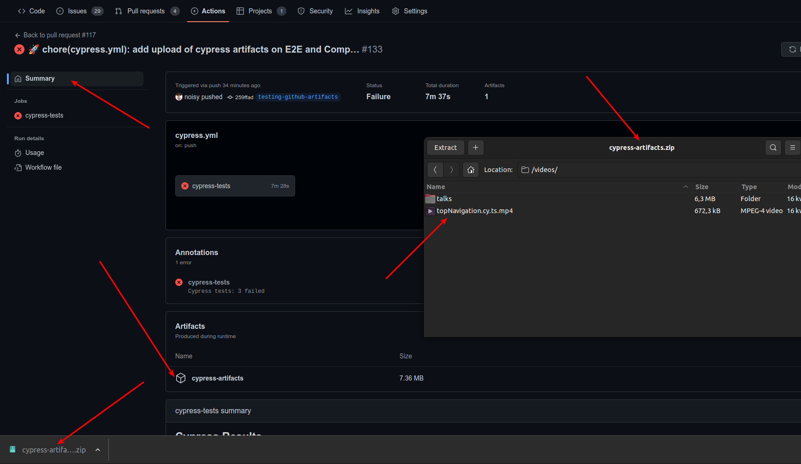

<!-- https://marketplace.visualstudio.com/items?itemName=marp-team.marp-vscode -->

# How to configure Cypress in own project

---

## How much time is needed to configure Github

... to run simple test like this

```typescript
describe("My Awesome Website", () => {
  it('should contain "my awesome website" in an h1 tag', () => {
    cy.visit("https://www.myawesomewebsite.com");
    cy.get("h1").contains("my awesome website");
  });
});
```

For every commit in master/main/dev/release branches/PRs?

---

### How to configure Cypress with Github repository with Cypress Github Action

#### For master/main/dev and release branches

- Requirenment: Dedicated instance of application refreshed after each commit
- Example configuration of .github/workflows/cypress.yml

Main benefit:

- Speed up release process, because a lot of tests could be checked automatically

---

## How to configure Cypress for every PR

- Requirenment (still!): Dedicated instance of application refreshed after each commit
  - instance do not have to be publicly available (with subdomain, ssl certificate, etc.)
  - instance can be created in the same environment in which cypress tests are run as on localhost

---

My own experience:

- My application is basically do not have a backend, so I can very quickly create a new instance with:

  - `git clone`
  - `npm install`
  - `npm run build`
  - `npm run preview`

---

### Problems:

Most projects are not so simple (duh!)

- If your whole project is full dockerized, and you can bootstrap it with single command like `docker-compose up`, then you are lucky.

- If your project do not requires complicated database setup, then you are lucky.

---

### Let's assume that you are lucky :)

Github action needs to be modified from/to

```yaml
on:
  push:
    branches:
      - main
```

```yaml
on:
  push:
    branches:
      - main
  pull_request:
```

---

### How to enable Cypress comments in Pull Requests and why in my opinion this is important

Everything is fine to the moment the tests are passing, but what if they are not?

You need to determined what is the reason of failing tests:

- Is it a bug in the application?
- Or test simply needs to be updated?

---

Of course you can check it locally, but this requires additional time and effort. There is a faster way to do it:

# Screenshots and video recordings!

---

# You can start recording videos in couple of different ways

---

1. You can produce videos recordings and videos, by adding the following properties to your `cypress.config.ts` file:

```json
{
  //...
  "video": true,
  "videosFolder": "cypress/videos",
  "screenshotOnRunFailure": true,
  "screenshotsFolder": "cypress/screenshots"
}
```

---

and store them as artefacts in Github Actions, by adding the following step to your workflow file:

```yaml
- name: E2E tests - Upload test artifacts
  if: ${{ failure() }}
  uses: actions/upload-artifact@v3
  with:
    name: cypress-artifacts
    path: |
      cypress/screenshots/
      cypress/videos/
```

---

But this will be far from being perfect, because:

- you will have to go to a summary of failed github action, to find attached artifacts
- you will have to download & unzip them locally to view them
- there is also a retention limit for artefacts ([more info](https://docs.github.com/en/actions/learn-github-actions/usage-limits-billing-and-administration#artifact-and-log-retention-policy))

---



---

# You can use Cypress Dashboard

Drawbacks:

- You need to pay for it (limited free plan)

But there are a lot of other cool features!

---

To configure it, you need to add `record` property to your `cypress.json` file:

```json
{
  "projectId": "your-project-id",
  "record": true
}
```

---

# Interesting ideas

To run a GitHub Action on a Pull Request, but only after someone pastes a comment with a body "e2e please!", you can use the `on: issue_comment` event, along with the `if` conditional statement.

Here's an example of how you can set it up in your workflow file:

```yaml
name: Run E2E tests

on:
  issue_comment:
    types: [created]

jobs:
  e2e_tests:
    runs-on: ubuntu-latest
    if: |
      contains(github.event.comment.body, 'e2e please!') &&
      github.event.issue.pull_request
    steps:
      - name: Checkout code
        uses: actions/checkout@v2
        with:
          ref: ${{ github.event.pull_request.head.sha }}
      - name: Install dependencies
        run: npm install
      - name: Run E2E tests
        run: npm run e2e
```

This workflow listens for new comments on issues and PRs. When a comment is created, it checks whether the comment body contains the text "e2e please!" and is associated with a pull request. If both conditions are true, it proceeds to run the `e2e_tests` job, which checks out the code at the head of the pull request, installs the dependencies, and runs the E2E tests.

Note that this example assumes you have already set up your E2E testing environment and scripts in your repository. Also, keep in mind that if no one ever posts the comment with "e2e please!", the action will never run.
